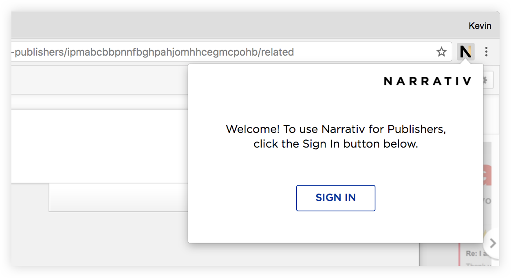

How to Download Narrativ Chrome Extension
================

Step 1. Navigate to Chrome Web Store
----------------

Search `Narrativ for Publishers <https://chrome.google.com/webstore/detail/narrativ-for-publishers/ipmabcbbpnnfbghpahjomhhcegmcpohb>`_, and click **ADD TO CHROME**.

.. image:: _static/Instructions/1.png

Step 2. Add Extension
----------------

Click **Add Extension** when the confirmation window pops up.

.. image:: _static/Instructions/2.png
.. image:: _static/Instructions/3.png

Step 3. Sign In
----------------

The Narrativ extension will appear in the top right corner of Chrome. Click on the icon and sign in with your Narrativ dashboard credentials!*

*\*Email ursula@narrativ.com for your Narrativ dashboard access and credentials.*
