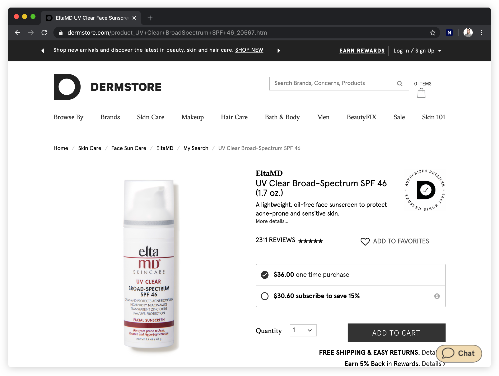
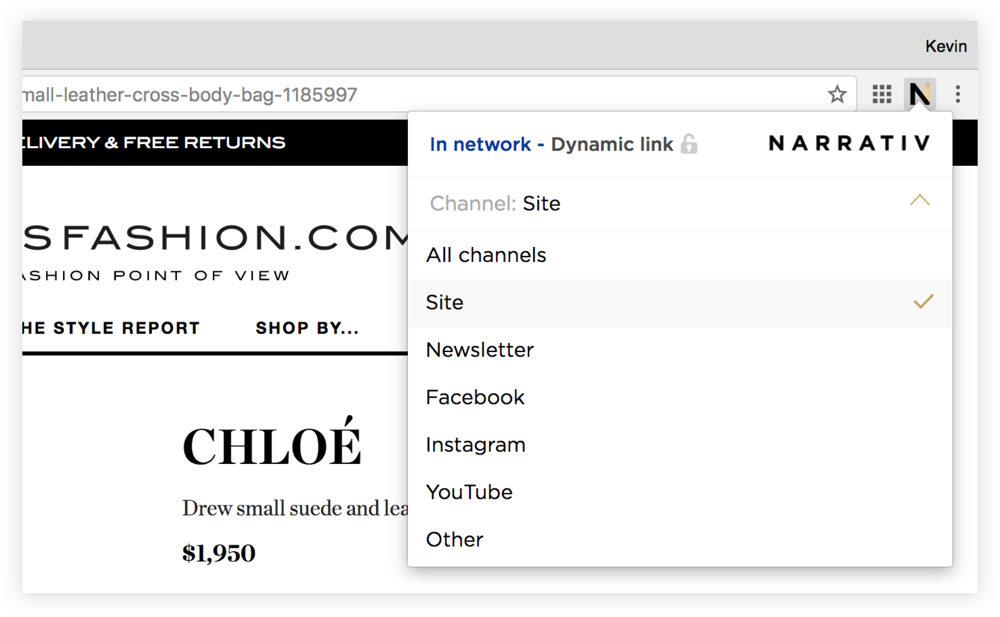
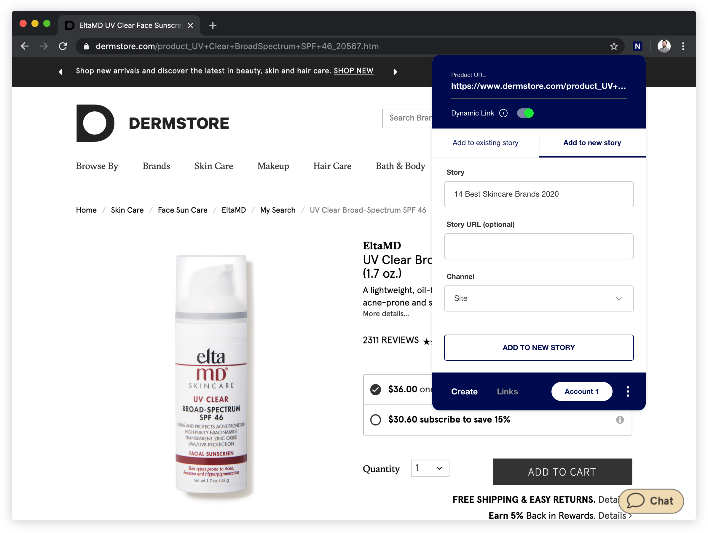
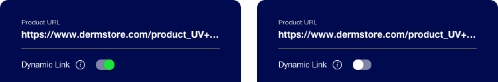

How to Use Narrativ Chrome Extension
====================================

Step 1. Select a product
------------------------

Navigate to any merchant that sells the product you want to SmartLink and click the Narrativ extension button.

Step 2. (Optional) Select a channel
-----------------------------------
Selecting a channel will filter existing articles to those created in that channel. If you don't select a channel, none will be assigned.

Step 3. Associate the product link with the story name
------------------------------------------------------

You can do this in one of two ways:

**1. Create a new article link**

  - Type the article name and date next to the gold “+” button, then click CREATE + LINK to create the link and the article.
  - Distinguish links for newsletters by creating them in the Newsletter channel and naming your newsletter articles “[Newsletter] [Date]”.
  - See `SmartLink Naming Conventions`_ for more best practices in naming articles.

**2. Select from the list of existing articles**

  - Select a channel to filter articles in that channel.
  - Scroll through the drop down box and click LINK next to the article where you want to generate a link.

Step 4. Select Dynamic or Exclusive link
----------------------------------------

Need to ensure the link only goes to one destination?

  - To make the link exclusive to your selected merchant for a direct sales deal, click the lock icon.
  - Note that doing this will prevent us from being able to optimize your revenue and replace out of stock links.

.. image:: _static/extension_instructions/Dynamic.png
.. image:: _static/extension_instructions/Exclusive.png

Step 5. Create your SmartLink
-----------------------------

  - Once you have created the SmartLink, its URL will be copied to your clipboard aautomatically and is ready for use.
  - Type the line you want to hyperlink in your CMS (e.g. “Shop Now”).
  - Paste the SmartLink URL into your hyperlink. When you publish the article, the SmartLink will be live. 

SmartLink Naming Conventions
============================

**1. Edit Name**

Ensure the article/ edit name you create matches the article title as shown verbatim on your site and add the editorial publish date to the end.

  - [Article name] [Date]
  - The 15 Best Eye Creams 9/15/17

**2. Naming newsletters**

Ensure that you distinguish between when you will be using SmartLinks in newsletters vs. using them in articles. For newsletters, ensure you enter an edit name as

  - [Newsletter] [Date]
  - Newsletter 9/15/17

**3. In-article link naming and reviews**

Where you want to include a hyperlink to an internal product review and to a merchant for one product, use the following format, putting the second review hyperlink underneath

  - [Product Brand, Product Name] [Price] (Shop Now)
    See full review here
  - La Mer The Illuminating Eye Gel, $150 (Shop Now)
    See full review here
