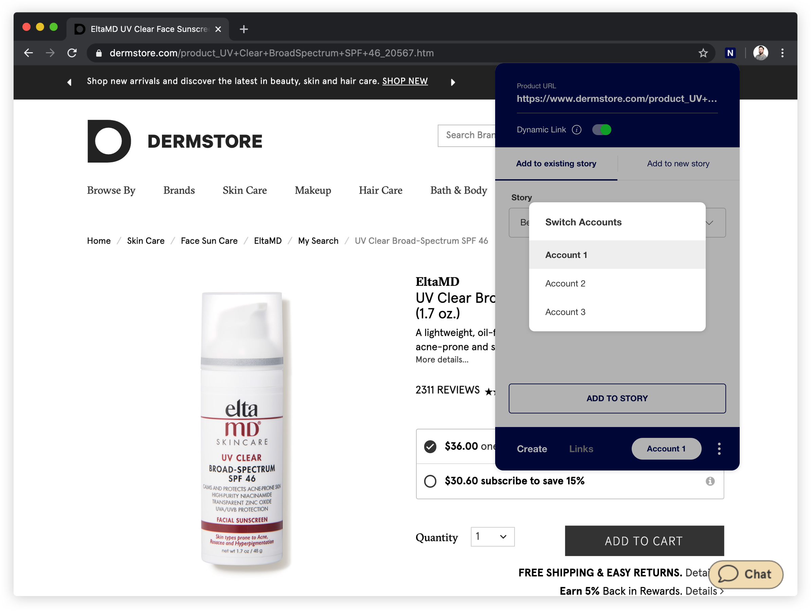
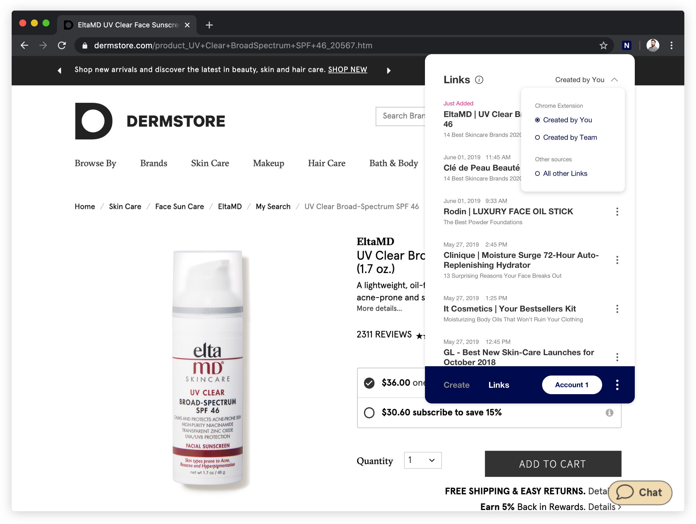
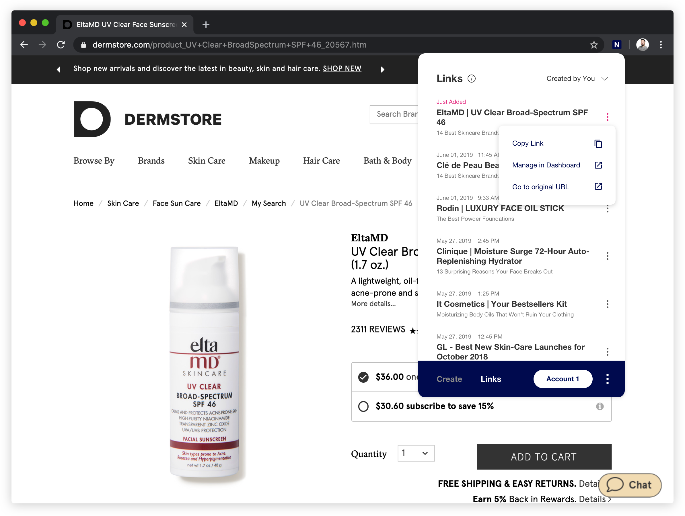

====================================
How to Use Narrativ Chrome Extension
====================================

Create Links
=============

1. Select Product
------------------------

.. image:: _static/extension_instructions/5.png

2. Select the account for your story
------------------------------------
For publishers with multiple brands, each brand will have it's own account. Be sure to select the right brand for your article and link.

3. Associate product to a story
-----------------------------------
You can do this in one of two ways. **A. Add to existing story** or **B. Add to new story**

**A. Add to existing story**

    - Select or search for existing story from dropdown

.. image:: _static/extension_instructions/6.png

**B. Add to new story**

    - Type in story name
    - Add story URL (optional)
    - Select channel

.. image:: _static/extension_instructions/7.png

4. Need the link to only go to one destination?
-----------------------------------------------
Click the Dynamic link toggle off so it appears gray to ensure the link goes to your selected merchant.

Note that doing this will prevent us from being able to optimize your revenue and replace out of stock links.

.. image:: _static/extension_instructions/8.png

5. Create your Link
---------------------
Once you have created your Link by adding to an existing story or creating a new story, paste the Link into your CMS.

Copy Existing Links
===================

1. Select Link Tab
-------------------

2. You can Filter Links by:
---------------------------

- Created by You on the Chrome Extension
- Created by Team on the Chrome Extension
- Links from all other sources

3. Select any Link to copy to clipboard
---------------------------------------
Once you have copied your Link, paste the Link into your CMS.

