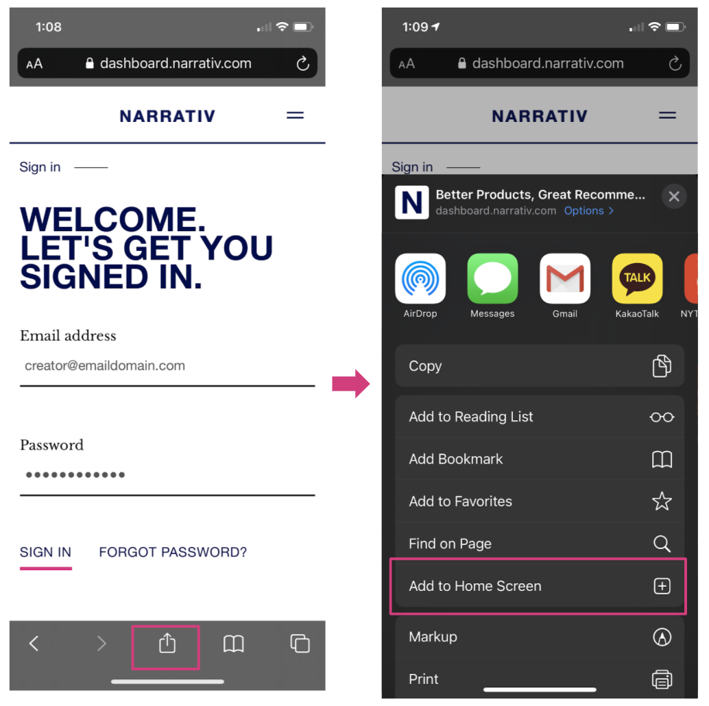
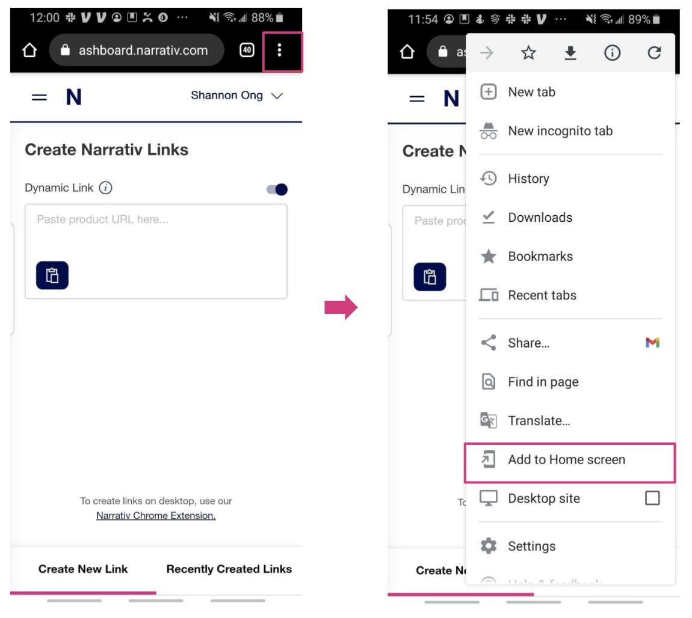

====================================
How to Create Narrativ Mobile Links
====================================

1. Log in to dashboard.narrativ.com on your phone – instructions below for Apple and Android
---------------------------------------------------------------------------------------------
On Apple’s Safari, hit the Share button at the bottom of your browser, then Add to Home Screen. You’ll see a Narrativ shortcut show up on your home screen for easy access.

On Chrome on your Android, hit the Menu at the top right of your browser, then Add to Home Screen. You’ll see a Narrativ shortcut show up on your home screen.

2. Once you’re logged in, paste in any product URL
---------------------------------------------------
.. image:: _static/mobile_link_instructions/1.png

Assign your link to an existing story/video/post or Create New Story and fill in the required fields.

.. image:: _static/mobile_link_instructions/2.png

3. Create and copy your link. You’re now ready to paste it into a story on any platform!
-----------------------------------------------------------------------------------------
.. image:: _static/mobile_link_instructions/3.png
