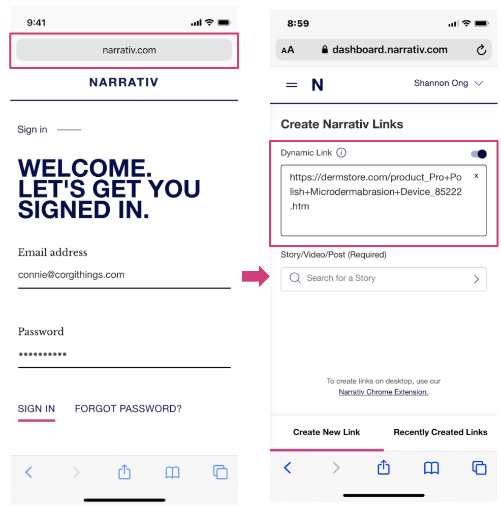
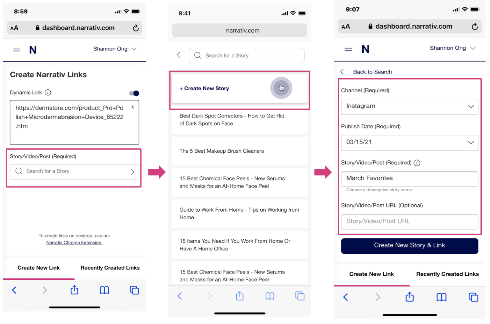
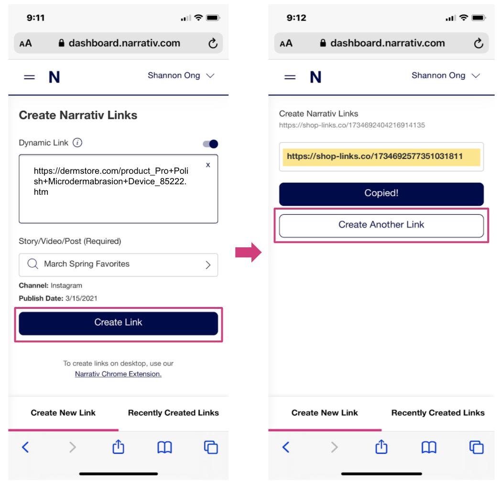
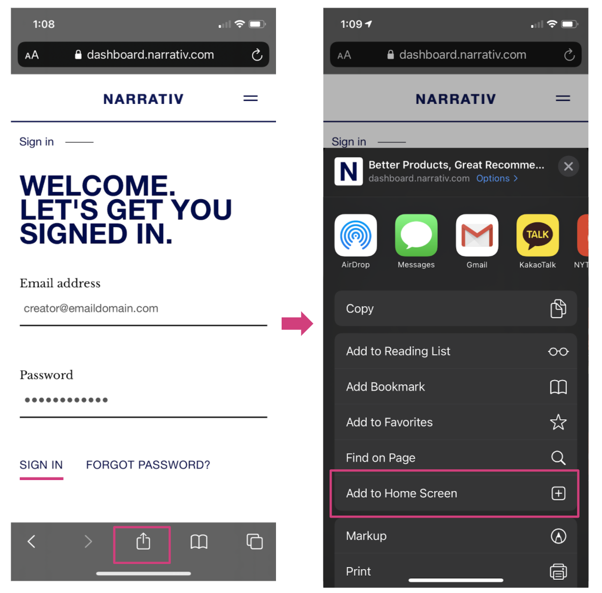
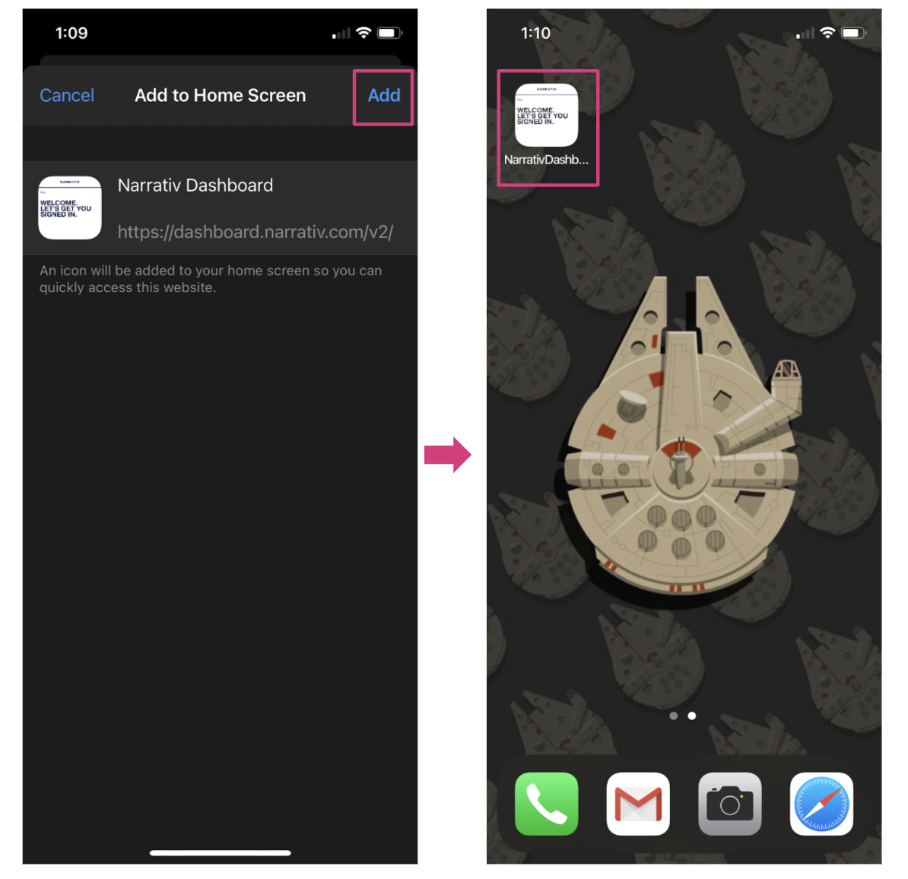

====================================
How to Use Mobile Link Creation
====================================

1. Sign into dashboard.narrativ.com on any mobile browser and paste in your product link
-----------------------------------------------------------------------------------------

2. Assign the link to an existing story or create a new one
------------------------------------------------------------
For publishers with multiple brands, each brand will have it's own account. Be sure to select the right brand for your
article and link.

3. Create and copy your link. You’re now ready to paste it into a story on any platform!
-----------------------------------------------------------------------------------------

PRO TIP: Want a Narrativ “app” on your phone so you don’t have to open a browser window to make links? Just add
dashboard.narrativ.com to your Home Screen.

EL: Optional to add to the step above but I don’t think it’s necessary

