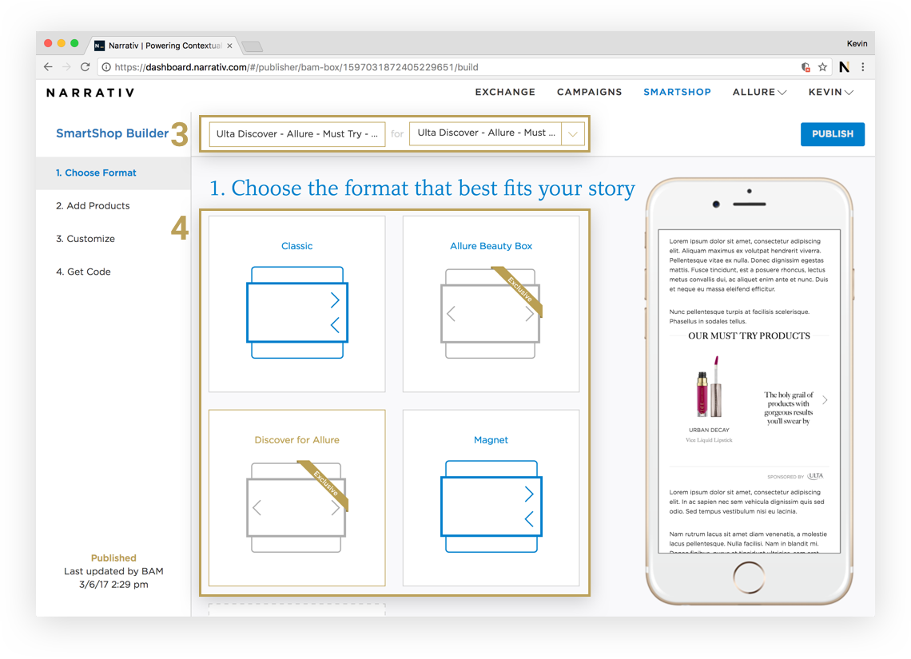
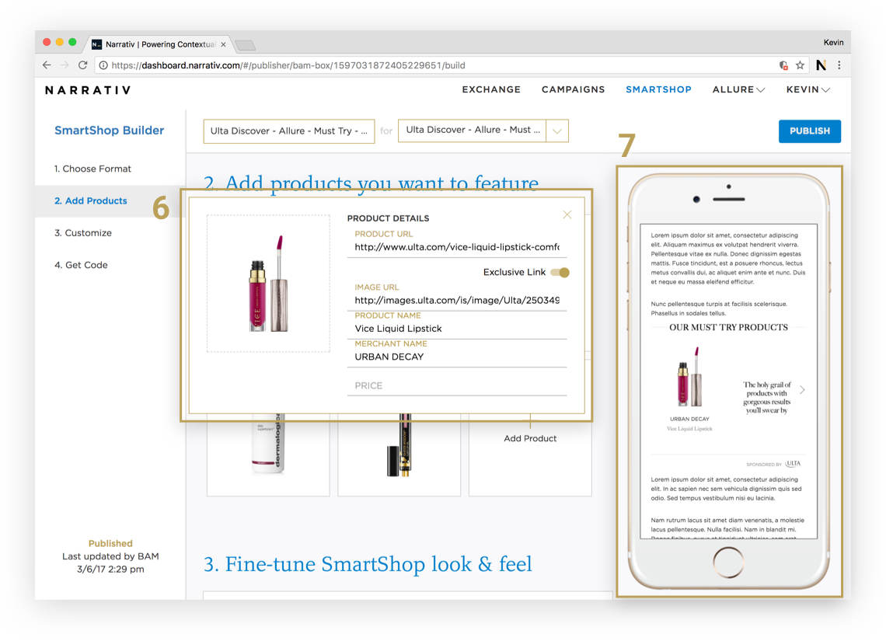

How to Build a SmartShop
================

Step 1. Sign into the Narrativ Dashboard
----------------

Select the SMARTSHOP button from the top navigation bar.

Step 2. Create a New SmartShop
----------------

Click **+ Create New SmartShop** or simply click on an existing shop to make edits.

.. image:: _static/builder_instructions/Builder1.png

Step 3. Type in a SmartShop name and Edit name
----------------

SmartShop name

  - Ensure you include which position number the SmartShop will have in the article
  - Include a description of the contents in the name to make analysis easy

Edit name

  - Type in or select an edit name to associate the box with an article
  - Ensure the article/ edit name you create matches the article title as shown verbatim on your site and add the date to the end
    e.g., The 15 Best Eye Creams 9/15/17

Step 4. Choose a format
----------------

Click on a format that best fits your story.

Step 5. Add products to your SmartShop
----------------

Click the box that says **Add Products**

.. image:: _static/builder_instructions/Builder3.png

Step 6. Enter product information
----------------

Fill out the product and image information for each tile you want to create.

For product images you can either:

  - Drag and Drop an image from your desktop
  - Upload an image from your files
  - Copy paste an image address link

Click out of the modal to close it when you’re done

Step 7. Preview your SmartShop
----------------

Preview your SmartShop using the mobile preview screen on the right hand side. This updates in real time to reflect your latest changes.

Preview screen let’s you see the scroll function and if you hover over products you will also see the met data that will be displayed.

**Note: You can click on the arrows next to product number to re-order the products in the box**

Step 8. Fine tune your SmartShop
----------------

  - **Title** - Add a title for the whole unit (e.g. “Refresh Your Skin”)
  - **Sponsored by** - Add a merchant logo to display as “Sponsored By”
  - **Hover data** - Change the meta-data that is displayed for each product

    - choose between information displayed below the product or on hover

  - **Shop button** - Turn on or off the “Shop” button displayed on hover

Step 9. Hit Publish
----------------

Select the blue Publish button in the top right corner to save your changes and create code for the unit that you will drop into your CMS

  .. image:: _static/builder_instructions/Builder5.png

Step 10. Select the code type you want to drop into your CMS
----------------

Copy/Paste the code into your site CMS

Note: Making changes and editing your SmartShop
----------------

Once the code is pasted in your story, and your unit is live on site you can navigate to the SmartShop builder on our dashboard to make changes to it at any time. Simply make any changes you want and re-click the “Publish” button when you’re done to push those changes to the unit on site. The changes should be live within ~5 minutes.

**Help and Support** - *Feel free to reach out to us at ursula@narrativ.com or laura@narrativ.com with any questions. We’re always happy to help!*
