Narrativ Merchant Tag
=====================

Functionality
-------------

The Narrativ merchant tag allows Narrativ to track user behavior on a merchant's site. Our auction system
optimizes merchant acquisition and ROI by analyzing data on page views and purchase behavior. No Personal
Identifying Information (PII) is captured. The tag runs asynchronously in the background so there is no impact
to page load times.

Implementation
--------------

We track two types of events for our partners - checkouts and page views:

* Place the checkout tag on the page that loads *after* your customer has finished shopping and paid
  for their purchase (your site's equivalent of a "Thank you for your order" page).

* Place the page view tag on every other page that loads during your user's journey, so that we can
  empower you with data on what products customers are looking at before they check out.
  *Important! Replace "accountname" with your Narrativ account name in all snippets.* Reach out to
  hello@narrativ.com for help with your Narrativ account name as needed.

Adding Information About Your Checkout Page
-------------------------------------------

For checkout events, you have to fill in some information about the checkout before loading our Javascript. This is
done by inserting the relevant data into a variable called ``window.BAMX_EVENT_DATA``. If a field is optional, you
can leave it out if you choose not to include the data.

**window.BAMX_EVENT_DATA**

.. list-table::
   :widths: 30 10 60
   :header-rows: 1

   * - Field Name
     - Type
     - Description

   * - page_type
     - string
     - Required. Must be "checkout" to tell the tag to fire a checkout event.

   * - user_id
     - string
     - Optional. The ID the user has in your system, if available.

   * - order_id
     - string
     - Required. The unique order_id for the checkout that just completed.

   * - order_value
     - float
     - Required. The total purchase price of the order.

   * - currency
     - string
     - Required. The three digit code for the currency that order_value is in (ex: 'USD'). Uses `ISO 4217`_

   * - products_purchased
     - array
     - Required. An array of Product objects representing the purchased items, as defined below.

**products_purchased** (array)

.. list-table::
   :widths: 30 10 60
   :header-rows: 1

   * - Field Name
     - Type
     - Description

   * - product_id
     - string
     - Required. The unique identifier for this product.

   * - product_name
     - string
     - Required. The name of the product.

   * - product_price
     - float
     - Required. The price of the product.

   * - product_quantity
     - integer
     - Required. The number of this product purchased in this order.

   * - product_category
     - string
     - Optional. The `Google category`_ of the product.

   * - product_brand
     - string
     - Optional. The brand of the product.

   * - product_image
     - string
     - Optional. The URL of the product image.

   * - product_size
     - string
     - Optional. The size of the product.

   * - product_color
     - string
     - Optional. The color of the product.

**Full Example**

The example below is what your implementation might look like. However, don't copy and paste it as is. Insert the checkout
information from your own page into our data layer using Javascript before loading the Narrativ tag.

Remember to replace "accountname" with your Narrativ account name.

::

    <!-- Begin Narrativ Jstag -->
    
    <!-- End Narrativ Jstag -->

Adding Information for the Page View Tag
----------------------------------------

The page view tag goes on every page except for pages with PII. Remember to change "accountname" to your Narrativ
account name.

The example below is what your implementation might look like. Don't copy and paste it as is. Insert the page view
information into our data layer using Javascript before loading the Narrativ tag.

::

  <!-- Begin Narrativ Jstag -->
  
  <!-- End Narrativ Jstag -->

Google Tag Manager Walkthrough
------------------------------

The instructions below are for implementing the Narrativ pixel using a "Custom HTML" tag in Google Tag Manager
Start by navigating to your Google Tag Manager Dashboard.

- Select the "Tags" menu item from the menu on the left-hand side of the page.
- Once on the "Tags" page, select the "New" button to create a new tag.
- Select the "Tag Configuration" box to begin making a new pixel.

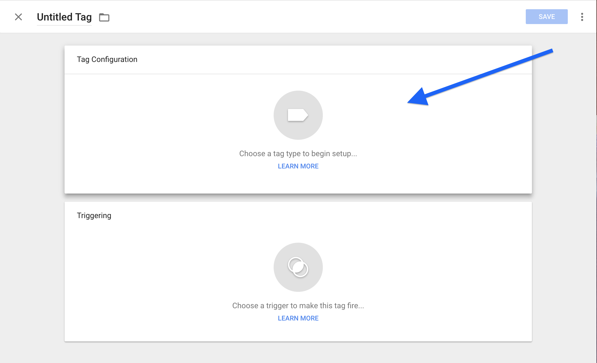

- Select the "Custom HTML" option to open a text field, and copy and paste the above code for the **Page View Tag**. Make sure you replace *"accountname"* with your Narrativ account name.

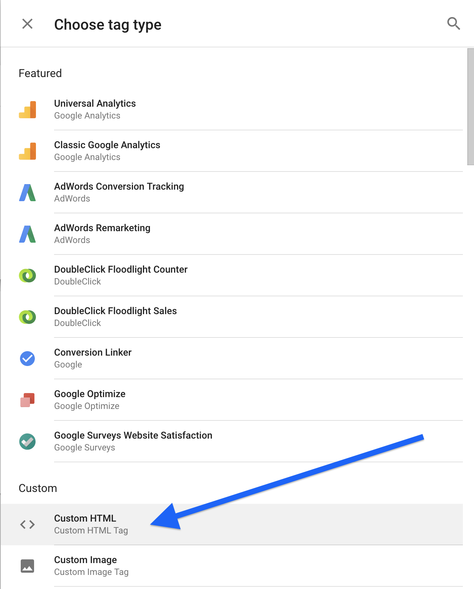

- Enter the code from the "Page View Tag" snippet (See the section before this). Replace the content of ``BAMX_EVENT_DATA`` with the relevant data from your data layer.

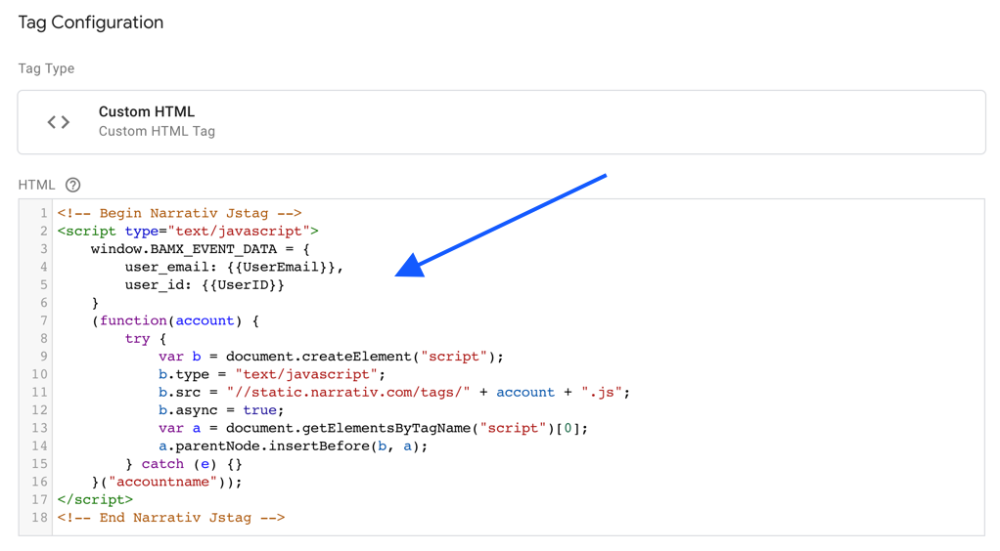

- Select "All Pages" as the correct trigger for this "Page View Tag."

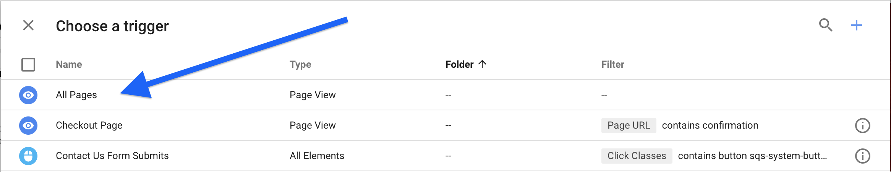

- Name the Tag "Narrativ Page Impression" and double check that the trigger is set to "All Pages"

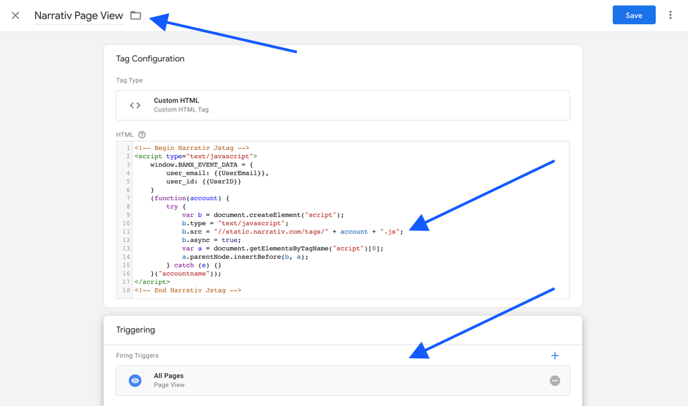

- For the "Check Out Pixel", create a new tag and open the text field.

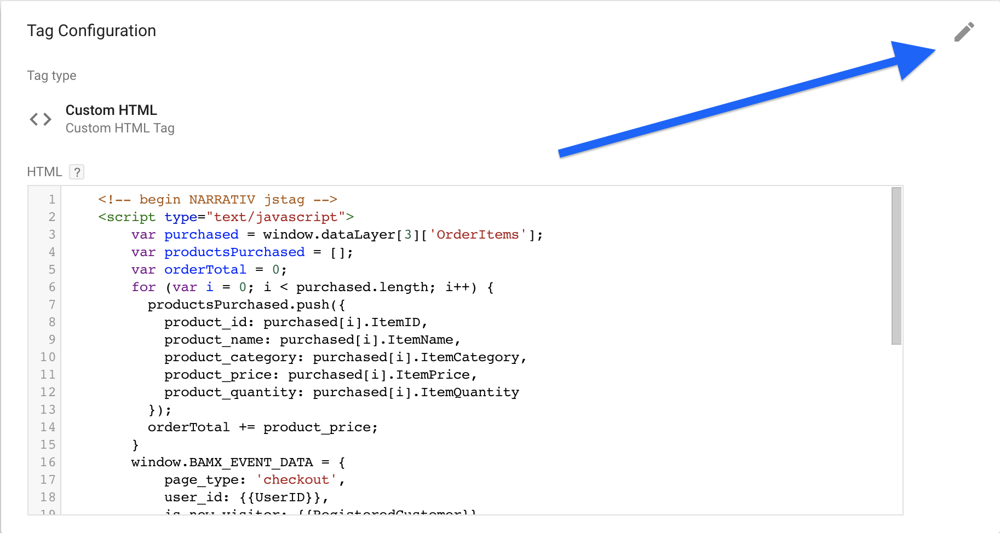

- This example is using a dummy data layer. You will have to customize "var purchased" to point at how you access the order content in your data layer.

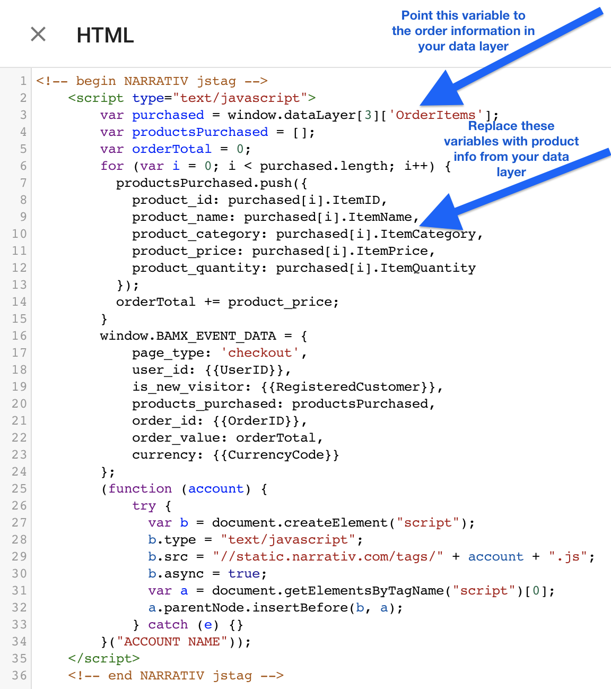

- Add box under "Triggering" to add a trigger for this tag.

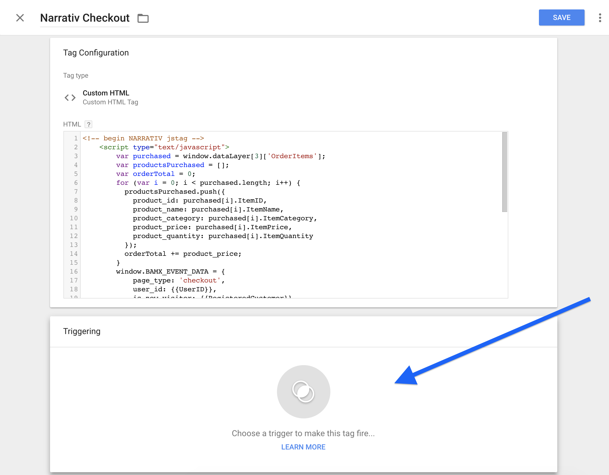

- If you don’t already have a trigger for checkout pages, then it’s easy to create one!

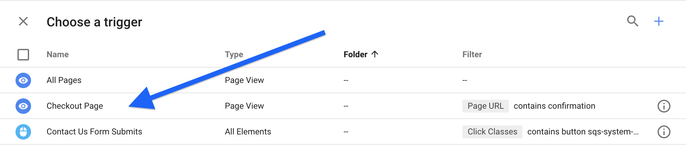

- The below example has a series of triggers based off of common URL types for checkout or confirmation pages. (E.g. narrativ.com/checkout/ will trigger the "Checkout Page" option). Replace "checkout" with whatever word your site uses on checkout pages. Remember, you only need one trigger!

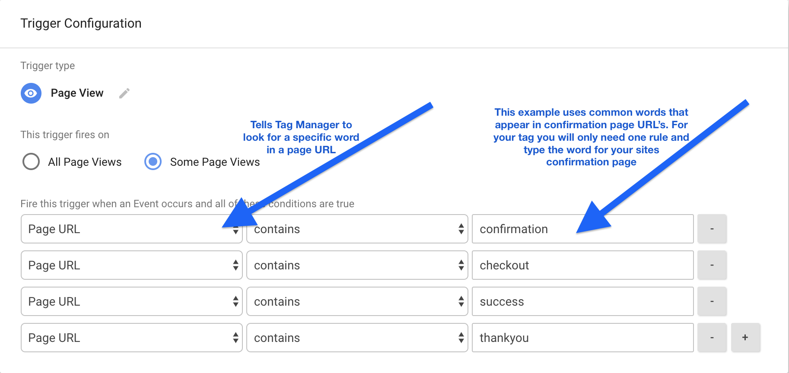

- Double check the tag name, make sure you’ve updated the code with the information on your checkout page, and make sure you’ve selected the correct trigger.

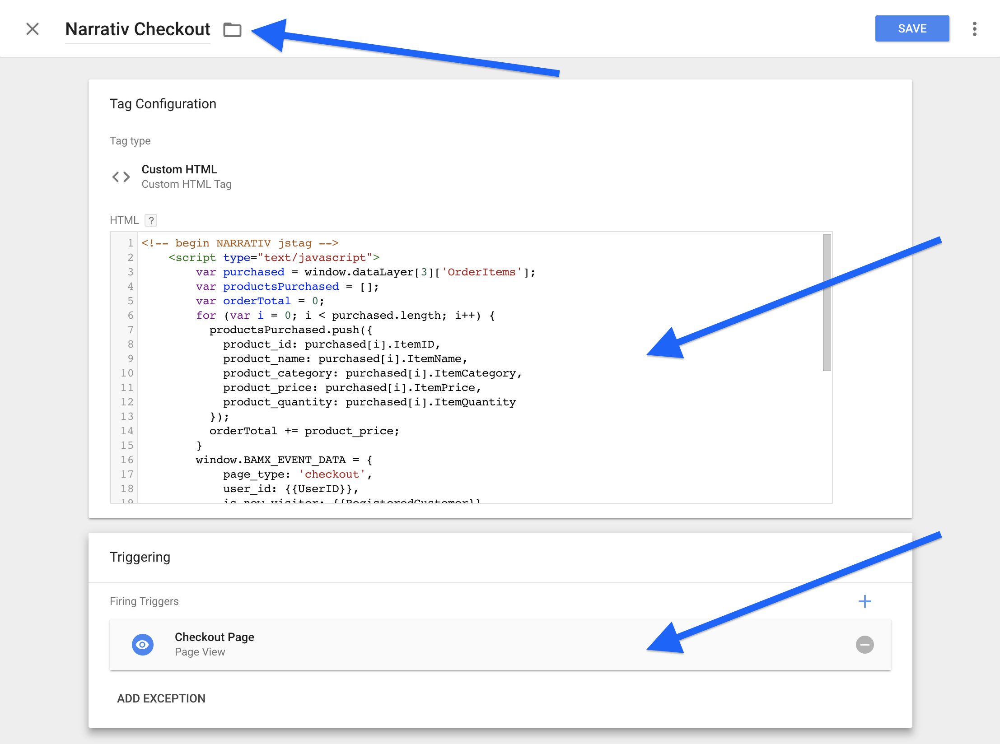

- Make sure that the tag(s) are showing up in the "Tag" tab.

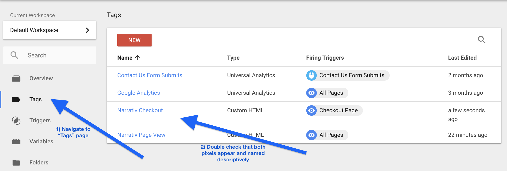

- Preview the changes made and fix any errors that pop up in the window.

.. image:: _static/pixel_implementation_screenshots/submit_2_review.png

- Click the "Submit" button to save your changes (this step is not final)

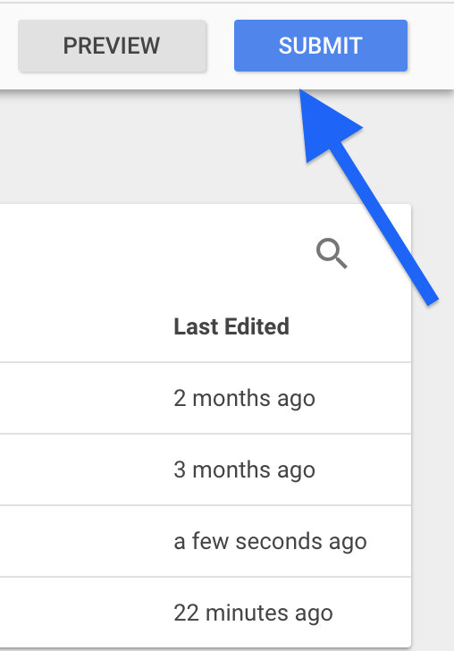

- Double check that everything you worked on is in this submission. Name the submission something like "Adding Narrativ Pixel" so that it’s easy to find if you need to go back and debug any issues in the future.

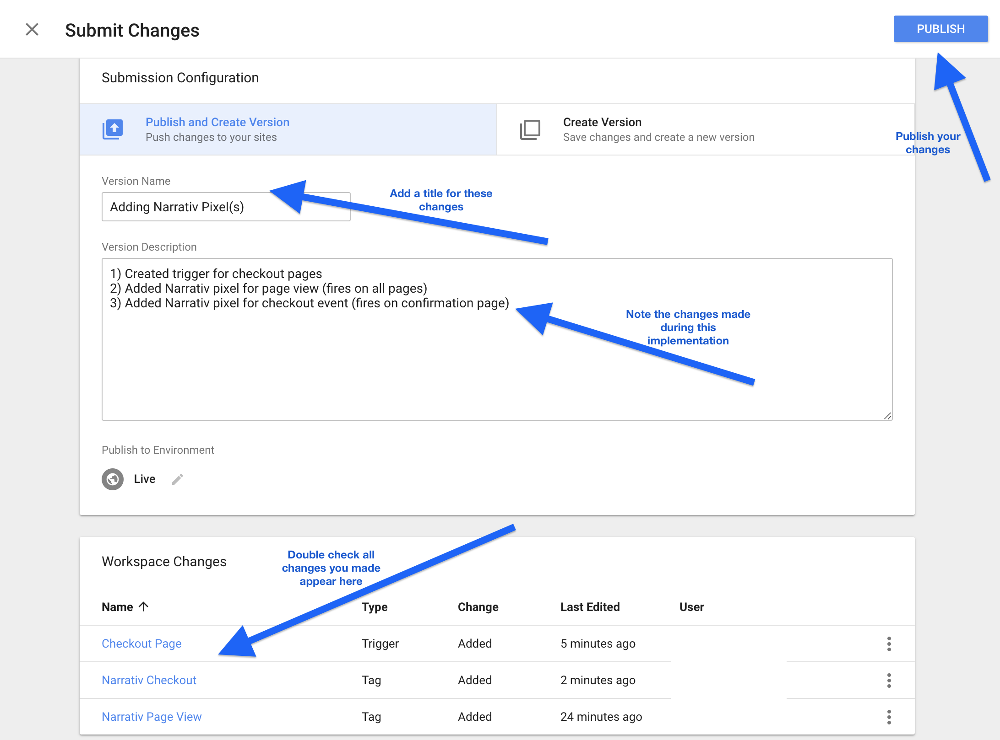

You did it!!

If you have any issues during this process then reach out to your Narrativ contact or hello@narrativ.com

.. _Google category: https://support.google.com/merchants/answer/6324436?hl=en
.. _ISO 4217: https://www.iso.org/iso-4217-currency-codes.html
